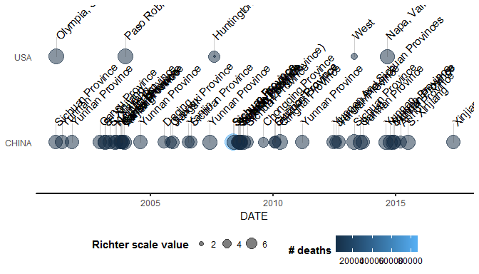

<!-- README.md is generated from README.Rmd. Please edit that file -->
[](https://travis-ci.org/clems/NoaaCS)

This vignette gives a brief overview of the NoasCS R package created for the purpose of visualizing NOAA earthquake data. It processes data from [NOAA database](https://www.ngdc.noaa.gov/nndc/struts/form?t=101650&s=1&d=1) and visualizes them using `ggplot2` and `leaflet` packages.

Package functions
-----------------

There are six exported functions available to users:

-   `eq_clean_data()`
-   `geom_timeline()`
-   `geom_timeline_label()`
-   `theme_timeline()`
-   `eq_create_label()`
-   `eq_map()`

Further we give a short description with examples how to use the functions. For the purposes of these examples we will use data from NOAA that can be found in the package directory under `\extdata` folder.

Clean data
----------

The first function is required to clean data for the visualization. It creates a DATE column in `Date` format, transforms latitude and longitude to numeric format and trims country from LOCATION\_NAME.

``` r
filename <- system.file("extdata/signif.txt", package = "NoaaCS")
data <- readr::read_delim(filename, delim = "\t")

eq_clean_data(data)
#> Warning: Too few values at 720 locations: 7, 19, 27, 32, 47, 50, 52, 53,
#> 71, 88, 108, 113, 126, 131, 140, 146, 149, 163, 171, 177, ...
```

Visualize earthquake timeline
-----------------------------

The next three functions use `ggplot2` package to visualize earthquake timeline. The basic `geom_timeline()` geom requires clean data from the previous paragraph. The required aesthetics is `x` with dates, optional are `y` for grouping by country, and `size` and `color` that can be use according to user needs. The `geom_timeline_label()` function requires additional `label` aesthetic for labeling. For better visualization of these two geoms, `theme_timeline()` theme was added. Here is an example:

``` r
data %>% eq_clean_data() %>%
     filter(COUNTRY %in% c("USA", "CHINA"), YEAR > 2000, DEATHS>0) %>%
     ggplot(aes(x = DATE,
                y = COUNTRY,
                color = DEATHS,
                size = as.numeric(EQ_PRIMARY)
     )) +
     geom_timeline() +
     geom_timeline_label(aes(label = LOCATION_NAME), n_max = 5) +
     theme_timeline() +
     labs(size = "Richter scale value", color = "# deaths")
#> Warning: Too few values at 720 locations: 7, 19, 27, 32, 47, 50, 52, 53,
#> 71, 88, 108, 113, 126, 131, 140, 146, 149, 163, 171, 177, ...
#> Warning: Ignoring unknown parameters: n_max
#> Warning: Removed 1 rows containing missing values (geom_timeline_label).
```



Visualize earthquakes on map
----------------------------

The package uses `leaflet` functions to visualize earthquakes on a map using `eq_map()` function. The map is automatically trimmed to display the input data frame. Optional annotations can be created using `eq_create_label()` function. The result is an interactive map where user can click on individual points to get details.
